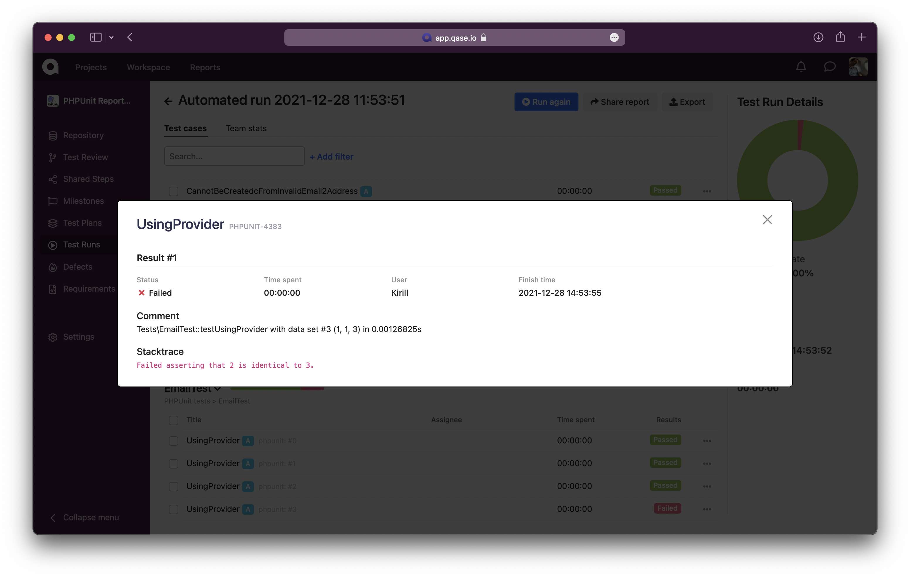

> # Qase TMS PHPUnit reporter
>
> Publish results simple and easy.

## How to integrate

```bash
composer require qase/phpunit-reporter
```

## Example of usage

The PHPUnit reporter has the ability to auto-generate test cases
and suites from your test data.

But if necessary, you can independently register the ID of already
existing test cases from TMS before the executing tests. For example:

```php
/**
 * @qaseId 3
 */
public function testCanBeUsedAsString(): void
{
    $this->assertEquals(
        'user@example.com',
        Email::fromString('user@example.com')
    );
}
```
To run tests and create a test run, execute the command:

```bash
$ ./vendor/bin/phpunit
```


A test run will be performed and available at:
```
https://app.qase.io/run/QASE_PROJECT_CODE
```

If test fails, a defect will be automatically created

## Using parameterization

PHPUnit reporter also allows you to perform parameterization of the test case. To do this, you need to specify a dataprovider. Example:
```php
    /**
     * @dataProvider additionProvider
     */
    public function testUsingProvider($a, $b, $expected)
    {
        $this->assertSame($expected, $a + $b);
    }

    public function additionProvider()
    {
        return [
            [0, 0, 0],
            [0, 1, 1],
            [1, 0, 1],
            [1, 1, 3]
        ];
    }
```


## Configuration

Add to your `phpunit.xml` extension:

```xml
<extensions>
  <extension class="Qase\PHPUnit\Reporter"/>
</extensions>
```

Reporter options (* - required):

- `QASE_REPORT` - toggles sending reports to Qase.io, set `1` to enable
- *`QASE_API_TOKEN` - access token, you can find more information [here][auth].
- *`QASE_PROJECT_CODE` - code of your project (can be extracted from main page of your project,
  as example, for `https://app.qase.io/project/DEMO` -> `DEMO` is project code here.
- *`QASE_API_BASE_URL` - URL endpoint API from Qase TMS, default is `https://api.qase.io/v1`.
- `QASE_RUN_ID` - allows you to use an existing test run instead of creating new.
- `QASE_RUN_NAME` - Set custom Run name, when new run is created.
- `QASE_RUN_DESCRIPTION` - Set custom Run description, when new run is created.
- `QASE_RUN_COMPLETE` - performs the "complete" function after passing the test run.
- `QASE_ENVIRONMENT_ID` - environment ID from Qase TMS
- `QASE_LOGGING` - toggles debug logging, set `1` to enable

The configuration file should be called `phpunit.xml`, an example of such a file:

```xml
<?xml version="1.0" encoding="UTF-8"?>
<phpunit>
  <extensions>
    <extension class="Qase\PHPUnit\Reporter"/>
  </extensions>
  <testsuites>
    <testsuite name="qase-phpunit">
      <directory>./tests</directory>
    </testsuite>
  </testsuites>
  <php>
    <env name="QASE_REPORT" value="1" force="true" />
    <env name="QASE_API_TOKEN" value="<api_key>" force="true" />
    <env name="QASE_PROJECT_CODE" value="<project_code>" force="true" />
    <env name="QASE_API_BASE_URL" value="https://api.qase.io/v1" force="true" />
    <env name="QASE_RUN_ID" value="" force="true" />
    <env name="QASE_RUN_NAME" value="PHPUnit run" force="true" />
    <env name="QASE_RUN_DESCRIPTION" value="PHPUnit automated run" force="true" />
    <env name="QASE_RUN_COMPLETE" value="1" force="true" />
    <env name="QASE_ENVIRONMENT_ID" value="1" force="true" />
    <env name="QASE_LOGGING" value="1" force="true" />
  </php>
</phpunit>
```

<!-- references -->

[auth]: https://developers.qase.io/#authentication
