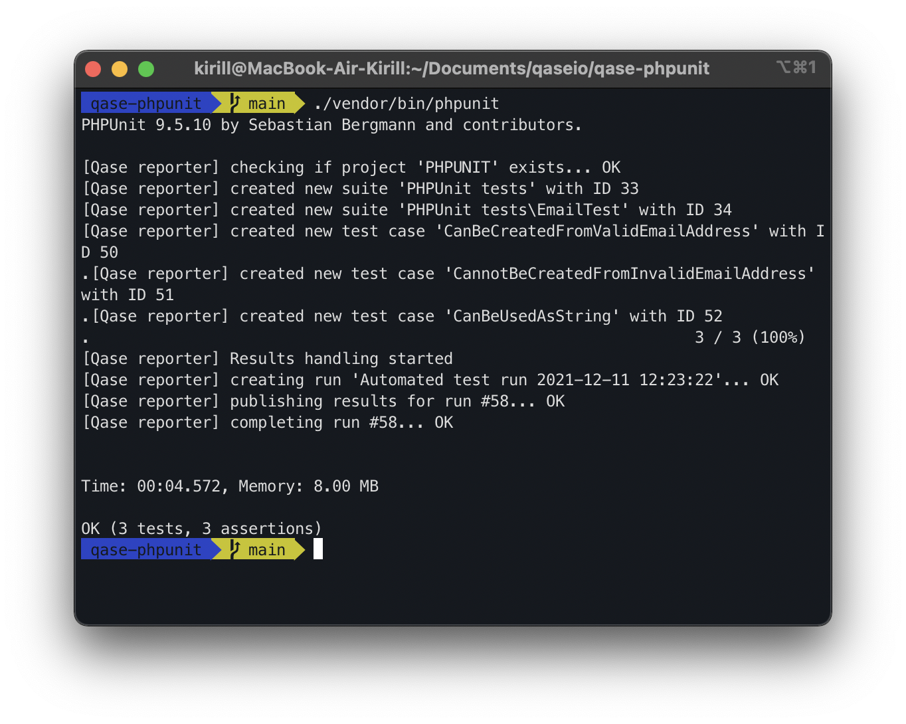

# Qase PHPUnit Reporter

## Install reporter: 

In the root of your application, run the command:
```
composer require qase/phpunit-reporter
```


## Usage:

The PHPUnit reporter has the ability to auto-generate test cases and suites from your test data.

But if necessary, you can independently register the Id of already existing test cases from TMS before the executing tests. For example:

```php
    /**
     * @qaseId 3
     */
    public function testCanBeUsedAsString(): void
    {
        $this->assertEquals(
            'user@example.com',
            Email::fromString('user@example.com')
        );
    }
```

You should also have an active item in the project settings at
```
https://app.qase.io/project/QASE_PROJECT_CODE/settings/options
```
option in the Test Runs block:
```
Allow submitting results in bulk
```

To run the test and create a test run, execute the command:
```
./vendor/bin/phpunit 
```
​

The test run will be performed and available at:
```bash
https://app.qase.io/run/QASE_PROJECT_CODE
```

## Configuration:
Add to your phpunit.xml extension:
```xml
<extensions>
    <extension class="Qase\PHPUnit\Reporter" />
</extensions>
```
Reporter options (* - required):

- *`QASE_API_TOKEN` - Token for API access, you can find more information
  [here](https://developers.qase.io/#authentication)
- *`QASE_PROJECT_CODE` - Code of your project (can be extracted from main 
  page of your project: `https://app.qase.io/project/DEMOTR` - 
  `DEMOTR` is project code here
- *`QASE_API_BASE_URL` - URL Endpoint API from Qase TMS
- `QASE_RUN_ID` - Allows you to use a newly existing test run
- `QASE_COMPLETE_RUN_AFTER_SUBMIT` - Performs the "complete" function after passing the test run

The configuration file should be called phpunit.xml, an example of such a file:
```xml
<?xml version="1.0" encoding="UTF-8"?>
<phpunit>
  <extensions>
    <extension class="Qase\PHPUnit\Reporter" />
  </extensions>
  <testsuites>
    <testsuite name="qase-phpunit">
      <directory>./tests</directory>
    </testsuite>
  </testsuites>
  <php>
    <env name="QASE_PROJECT_CODE" value="project_code" force="true" />
    <env name="QASE_API_BASE_URL" value="https://api.qase.io/v1" force="true" />
    <env name="QASE_API_TOKEN" value="api_key" force="true" />
    <env name="QASE_COMPLETE_RUN_AFTER_SUBMIT" value="1" force="true" />
    <env name="QASE_RUN_ID" value=null force="false" />
  </php>  
</phpunit>
```


