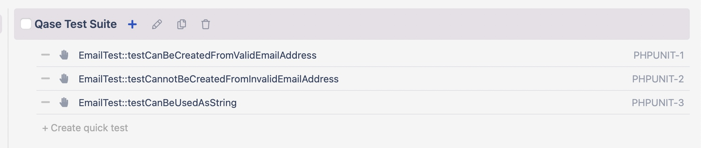
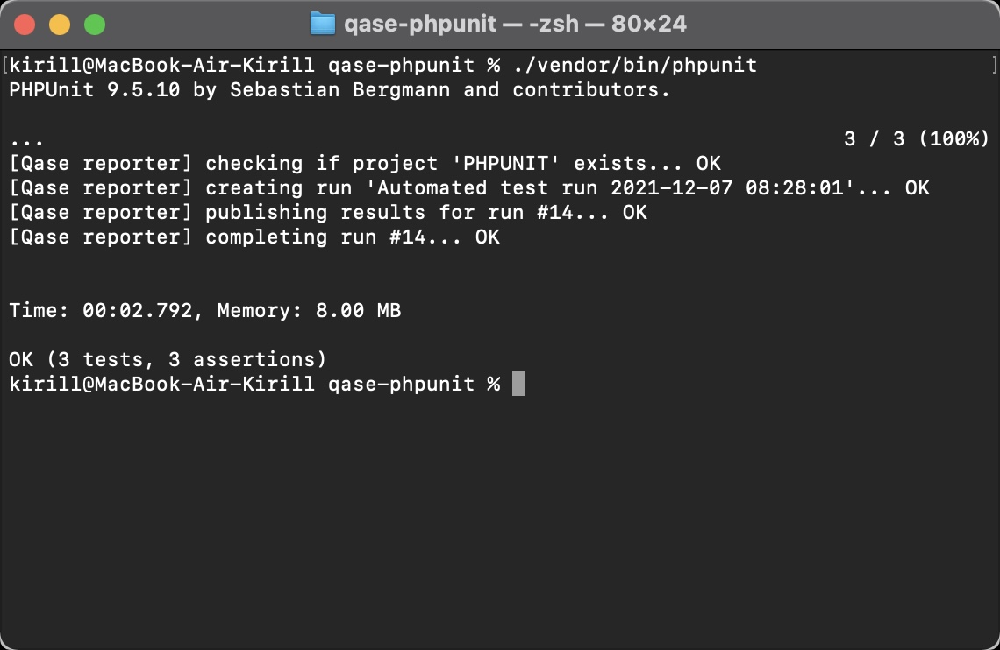

# Qase PHPUnit Reporter

[](https://www.apache.org/licenses/LICENSE-2.0)

Install reporter:
```bash
composer require qase/phpunit-reporter 
```

## Usage

​

Test cases in QASE TMS should be named according to the executable class and method, for example:
```bash
EmailTest::testCanBeCreatedFromValidEmailAddress - case with id 1
EmailTest::testCannotBeCreatedFromInvalidEmailAddress - case with id 2
EmailTest::testCanBeUsedAsString - case with id 3
```

To use the reporter functions, you must specify the id of the request from QASE TMS before executing the method:

```php
    /**
     * @qaseId 1
     */
    public function testCanBeCreatedFromValidEmailAddress(): void
    {
        $this->assertInstanceOf(
            Email::class,
            Email::fromString('user@example.com')
        );
    }
```
You should also have an active item in the project settings:
```bash
Allow submitting results in bulk
```

After that you can run your tests by providing custom reporter:
```bash
./vendor/bin/phpunit 
```
​

## Configuration

Reporter options (* - required):

- *`QASE_API_TOKEN` - Token for API access, you can find more information
  [here](https://developers.qase.io/#authentication)
- *`QASE_PROJECT_CODE` - Code of your project (can be extracted from main 
  page of your project: `https://app.qase.io/project/DEMOTR` - 
  `DEMOTR` is project code here)
- *`QASE_API_BASE_URL` - URL Endpoint API from Qase TMS

The configuration file should be called phpunit.xml, an example of such a file::
```xml
<?xml version="1.0" encoding="UTF-8"?>
<phpunit>
  <extensions>
    <extension class="Qase\PHPUnit\Reporter" />
  </extensions>
  <testsuites>
    <testsuite name="qase-phpunit">
      <directory>./tests</directory>
    </testsuite>
  </testsuites>
  <php>
    <env name="QASE_PROJECT_CODE" value="project_code" force="true" />
    <env name="QASE_API_BASE_URL" value="https://api.qase.io/v1" force="true" />
    <env name="QASE_API_TOKEN" value="api_key" force="true" />
    </php>  
</phpunit>
```


